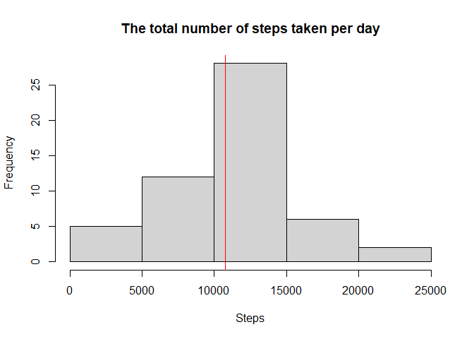
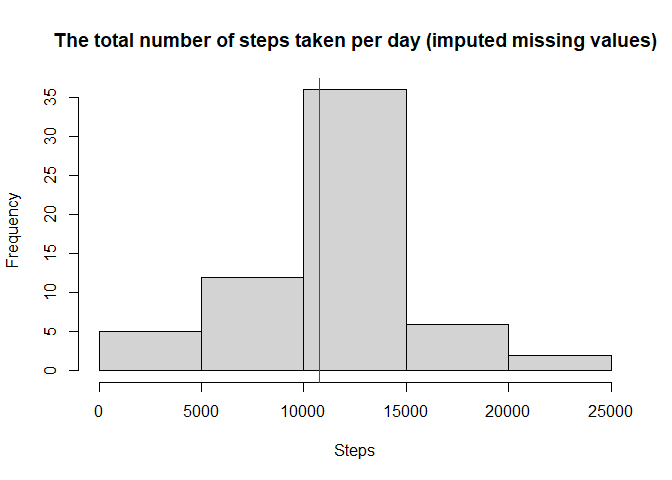
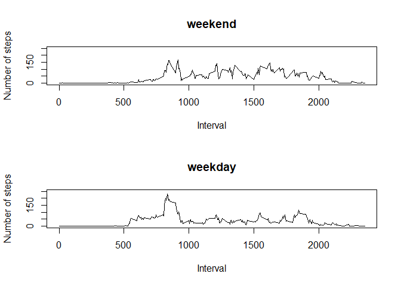

  
\   

### Loading and preprocessing the data
#### - load necessary libraries

```r
library(dplyr)
library(lubridate)
```
#### - download, unzip and load the data set

```r
dataset_url <- "https://d396qusza40orc.cloudfront.net/repdata%2Fdata%2Factivity.zip"
temp_zip <- tempfile()
download.file(dataset_url, temp_zip)
data_file <- unzip(temp_zip)
unlink(temp_zip)
data_set <- read.table(data_file, header = TRUE, sep = ',', na.strings = 'NA')
file.remove(data_file)
```
#### - convert date to Date

```r
data_set$date <- ymd(data_set$date)
```
\   
  
### What is mean and median number of steps taken per day?
#### - calculate the total number of steps taken per day

```r
StepsByDate <- summarise(group_by(data_set, date), steps = sum(steps))
```
#### - calculate mean and median number of steps taken each day

```r
StepsMean <- mean(StepsByDate$steps, na.rm = TRUE)
StepsMedian <- median(StepsByDate$steps, na.rm = TRUE)
```
#### - histogram of the total number of steps taken each day and show mean and median

```r
hist(StepsByDate$steps, main = 'The total number of steps taken per day', xlab = 'Steps')
abline(v = StepsMean, col = 'green')
abline(v = StepsMedian, col = 'red')
```

<!-- -->
  
#### Mean value of the total number of steps taken per day is 10766.1886792453 and median value is 10765.  
\    
  
### What is the average daily activity pattern?
#### - calculate the average number of steps taken per each interval across all days

```r
StepsByInterval <- summarise(group_by(data_set, interval), avg_steps = mean(steps, na.rm = TRUE))
```
#### - find interval with the maximum number of steps

```r
MaxInterval <- as.numeric(StepsByInterval[which.max(StepsByInterval$avg_steps), 1])
```
#### - make a time series plot of the average number of steps taken per interval
#### (show interval with the maximum number of steps)

```r
with(StepsByInterval, plot(interval, avg_steps, 
                        type = 'l', main = 'The average daily activity pattern', 
                        xlab = 'Interval', ylab = 'Average number of steps'))
abline(v = MaxInterval, col = 'red')
```

<!-- -->

#### The 5-minute interval with the maximum average number of steps taken is 835.
\

### Imputing missing values
#### - calculate the total number of missing values in the data set

```r
NrOfNA <- sum(is.na(data_set$steps))
```
#### The total number of missing values in the dataset is 2304.
#### A strategy for filling in all of the missing values in the dataset - use the mean of the same 5-minute interval.
#### - create a new data set with the missing data filled in

```r
data_set2 <- mutate(group_by(data_set,interval), 
                    steps = ifelse(is.na(steps), mean(steps, na.rm = TRUE), steps))
```
#### - calculate the total number of steps taken per day

```r
StepsByDate2 <- summarise(group_by(data_set2, date), steps = sum(steps))
```
#### - calculate mean and median number of steps taken each day

```r
StepsMean2 <- mean(StepsByDate2$steps)
StepsMedian2 <- median(StepsByDate2$steps)
```
#### - histogram of the total number of steps taken each day and show mean and median

```r
hist(StepsByDate2$steps, main = 'The total number of steps taken per day (imputed missing values)', xlab = 'Steps')
abline(v = StepsMean2, col = 'green')
abline(v = StepsMedian2, col = 'red')
```

<!-- -->
  
#### Mean value of the total number of steps taken per day is 10766.1886792453 and median value is 10766.1886792453.
#### There is practically no difference with the values of the first data set. This means that for a given data set, the imputing of missing data did not have an effect.
\

### Are there differences in activity patterns between weekdays and weekends?
#### - create a new factor variable in the data set with two levels - “weekday” and “weekend”
####   (NB! my locale is Estonian)

```r
data_set2$wday <- as.factor(ifelse(weekdays(data_set2$date, abbreviate = TRUE) %in% c('L','P'),'weekend', 'weekday'))
```
#### - calculate the average number of steps taken per each interval separately for weekdays and weekends

```r
StepsByIntervalWD <- summarise(group_by(subset(data_set2, wday == 'weekday'), interval), avg_steps = mean(steps))
StepsByIntervalWE <- summarise(group_by(subset(data_set2, wday == 'weekend'), interval), avg_steps = mean(steps))
```
#### - create panel plot

```r
par(mfrow = c(2, 1))
with(StepsByIntervalWE, plot(interval, avg_steps, type = 'l', 
                             main = 'weekend',  xlab = 'Interval', ylab = 'Number of steps', ylim = c(0, 250)))
with(StepsByIntervalWD, plot(interval, avg_steps, type = 'l', 
                             main = 'weekday',  xlab = 'Interval', ylab = 'Number of steps', ylim = c(0, 250)))
```

<!-- -->

#### The figure shows that on the weekend activity is more evenly distributed throughout the day.
\

